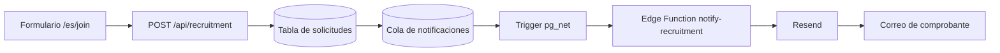

# Documentación operativa

Esta carpeta reúne la documentación técnica y editorial del sitio del Grupo 35
Esparzol. La guía principal para persistencia y correos de reclutamiento es
[`supabase.md`](supabase.md).

## Formularios, Supabase y correos

Los formularios de inscripción y voluntariado guardan sus datos en Supabase y
generan un comprobante por correo mediante una Edge Function y Resend.



La cola permite reclamar cada notificación de forma atómica, registrar el ID
devuelto por Resend y reintentar hasta tres veces si hay un error. Las tablas
con datos personales tienen RLS activo y no están disponibles para los roles
públicos.

### Archivos principales

| Archivo | Responsabilidad |
| --- | --- |
| `app/api/recruitment/route.ts` | Valida y guarda los formularios desde el servidor de Next.js. |
| `components/recruitment-forms.tsx` | Formularios y estados visibles en el navegador. |
| `supabase/migrations/202608150001_create_recruitment_submissions.sql` | Tablas privadas de inscripción y voluntariado. |
| `supabase/migrations/202608170001_create_recruitment_email_notifications.sql` | Cola, triggers de encolado y función de reclamación. |
| `supabase/migrations/202608200001_migrate_recruitment_email_to_resend.sql` | Compatibilidad con Resend y correo obligatorio para registros nuevos. |
| `supabase/migrations/202608210001_create_recruitment_email_webhook.sql` | Trigger asíncrono con `pg_net` y secretos leídos desde Vault. |
| `supabase/functions/notify-recruitment/index.ts` | Construye el comprobante y lo envía mediante la API de Resend. |
| `supabase/configure-recruitment-webhook.ps1` | Sincroniza una clave aleatoria entre Edge Functions y Vault. |

## Configuración inicial

### 1. Aplicación Next.js

Crear `.env.local` en la raíz:

```dotenv
SUPABASE_URL=https://TU_PROJECT_REF.supabase.co
SUPABASE_SECRET_KEY=sb_secret_REEMPLAZAR
```

Estas variables son exclusivas del servidor. Nunca deben comenzar con
`NEXT_PUBLIC_` ni guardarse en Git.

### 2. Migraciones

Ejecutar en Supabase SQL Editor, en orden:

1. `202608150001_create_recruitment_submissions.sql`
2. `202608170001_create_recruitment_email_notifications.sql`
3. `202608200001_migrate_recruitment_email_to_resend.sql`

La migración `202608210001_create_recruitment_email_webhook.sql` es aplicada
por el script del paso 5.

### 3. Resend en modo prueba, sin DNS

Crear una API key de Resend con permiso para enviar y guardar en **Supabase >
Edge Functions > Secrets**:

```dotenv
RESEND_API_KEY=re_REEMPLAZAR
RESEND_FROM=Grupo 35 <onboarding@resend.dev>
RESEND_TEST_RECIPIENT=CORREO_DE_LA_CUENTA_RESEND
```

En este modo, el correo escrito en el formulario se almacena y aparece en el
comprobante, pero todos los mensajes se entregan a `RESEND_TEST_RECIPIENT`. El
asunto comienza con `[PRUEBA]`. Resend exige que esa dirección sea la asociada
a la cuenta mientras se utilice `onboarding@resend.dev`.

No se debe compartir `RESEND_API_KEY` por chat, capturas ni commits.

### 4. Desplegar la Edge Function

Desde la raíz del proyecto:

```bash
npx supabase login
npx supabase functions deploy notify-recruitment --project-ref TU_PROJECT_REF
```

Comprobar el despliegue:

```bash
npx supabase functions list --project-ref TU_PROJECT_REF
```

`notify-recruitment` debe aparecer con estado `ACTIVE` y `verify_jwt=false`.
La función valida internamente una clave compartida con el trigger.

### 5. Configurar el webhook seguro

Desde PowerShell:

```powershell
.\supabase\configure-recruitment-webhook.ps1 -ProjectRef TU_PROJECT_REF
```

Este script:

1. Genera una clave criptográficamente aleatoria.
2. Configura `RECRUITMENT_WEBHOOK_SECRET` en la Edge Function.
3. Guarda la misma clave cifrada en Supabase Vault.
4. Guarda la URL de la función en Vault.
5. Habilita `pg_net` y aplica el trigger versionado.

La clave no se imprime ni queda almacenada en el repositorio. Volver a ejecutar
el script rota la clave de forma segura y actualiza ambas partes.

## Enviar un correo de prueba desde el formulario

No se necesita ejecutar manualmente la Edge Function. Después de completar la
configuración anterior, cada formulario válido dispara el flujo completo.

1. Ejecutar la aplicación:

   ```bash
   pnpm dev
   ```

2. Abrir `http://localhost:3000/es/join`.
3. Completar inscripción o voluntariado. Usar un correo con formato válido;
   durante la prueba el destinatario real seguirá siendo
   `RESEND_TEST_RECIPIENT`.
4. Aceptar el consentimiento y enviar.
5. Confirmar el mensaje de éxito en el navegador.
6. Revisar la bandeja, promociones y spam del correo asociado a Resend.

El correo esperado tiene un asunto similar a:

```text
[PRUEBA] Confirmación de solicitud de voluntariado | Grupo 35 Esparzol
```

La plantilla reproduce el lenguaje visual del formulario: fondo crema, tarjeta
blanca, encabezado morado, etiqueta verde, colores de las cuatro secciones,
campos ordenados, número de comprobante y próximos pasos. Está construida con
tablas y estilos inline para mantener compatibilidad con Gmail, Outlook y
pantallas móviles.

## Verificar la cola

Desde Supabase SQL Editor:

```sql
select
  submission_type,
  submission_id,
  status,
  attempt_count,
  provider_message_id,
  last_error,
  created_at,
  sent_at
from public.recruitment_email_notifications
order by created_at desc;
```

Un envío correcto debe mostrar:

- `status = 'sent'`
- `attempt_count = 1` en condiciones normales
- `provider_message_id` con valor
- `last_error = null`
- `sent_at` con fecha

Estados disponibles:

| Estado | Significado |
| --- | --- |
| `pending` | Esperando procesamiento. |
| `processing` | Reclamado por una ejecución de la Edge Function. |
| `sent` | Resend aceptó el correo. |
| `failed` | Falló el intento; puede reintentarse mientras no supere el máximo. |

## Reintentar un correo

Después de corregir la causa del error:

```sql
update public.recruitment_email_notifications
set
  status = 'pending',
  attempt_count = 0,
  provider_message_id = null,
  last_error = null,
  processing_started_at = null,
  sent_at = null,
  updated_at = now()
where id = 'ID_DE_LA_NOTIFICACION';
```

El cambio a `pending` activa nuevamente el trigger. No se debe reintentar antes
de arreglar la configuración, porque la cola agotará sus tres intentos.

## Problemas frecuentes

### Resend devuelve 401 o 403

- Crear una API key nueva y copiar el valor completo que comienza con `re_`.
- Guardarla sin `Bearer`, comillas ni espacios en `RESEND_API_KEY`.
- Confirmar que `RESEND_FROM` sea exactamente
  `Grupo 35 <onboarding@resend.dev>` durante las pruebas.
- Confirmar que `RESEND_TEST_RECIPIENT` sea el correo dueño de la cuenta de
  Resend.

Las secrets actualizadas quedan disponibles inmediatamente; normalmente no es
necesario volver a desplegar la función.

### La solicitud se guarda pero no aparece el correo

1. Consultar la cola y revisar `status` y `last_error`.
2. Confirmar que `notify-recruitment` esté `ACTIVE`.
3. Ejecutar nuevamente el script de configuración del webhook.
4. Revisar los logs de la Edge Function en Supabase.
5. Corregir la causa y reintentar la fila.

### Caracteres con tilde

La aplicación, la base de datos y el correo trabajan en UTF-8. Las pruebas
manuales desde terminal deben enviar también texto UTF-8; un carácter `�`
almacenado en la tabla ya está dañado y debe corregirse antes de reenviar. Los
formularios enviados desde el navegador conservan correctamente caracteres
como `á`, `é`, `í`, `ó`, `ú` y `ñ`.

## Pasar de prueba a producción

Para enviar el comprobante al correo escrito por cada persona:

1. Verificar un dominio propio en Resend mediante SPF y DKIM.
2. Cambiar `RESEND_FROM` a una dirección del dominio verificado.
3. Configurar opcionalmente `RECRUITMENT_REPLY_TO`.
4. Eliminar `RESEND_TEST_RECIPIENT` de las secrets de Supabase.
5. Enviar ambos formularios y verificar la cola.

Cuando `RESEND_TEST_RECIPIENT` no existe, la función utiliza como destinatario
el correo validado del formulario.

## Validación local antes de desplegar

```bash
npx --yes deno fmt --check supabase/functions/notify-recruitment/index.ts
npx --yes deno check supabase/functions/notify-recruitment/index.ts
pnpm lint
pnpm typecheck
pnpm build
git diff --check
```

## Documentos relacionados

- [`supabase.md`](supabase.md): detalles de esquema, permisos y despliegue.
- [`design-system.md`](design-system.md): identidad visual del sitio.
- [`technical-rules.md`](technical-rules.md): reglas técnicas del repositorio.
- [`mantenimiento.md`](mantenimiento.md): mantenimiento posterior al TCU.
